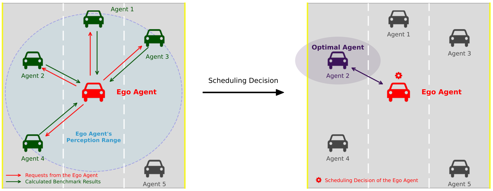

# WHALES

## Introduction
WHALES (**W**ireless en**H**anced **A**utonomous vehicles with **L**arge number of **E**ngaged agent**S**) is a CARLA-based cooperative perception dataset averaging 8.4 agents per sequence. It captures diverse viewpoints, agent behaviors, and multitask interactions to study scheduling, perception, and planning under realistic multi-agent constraints.

## News
- **2025-11-21** – Released WHALES dataset v1.0 with cooperative scheduling benchmarks.
- **2025-6-17** – WHALES was accepted by IROS 2025!

## Table of Contents
- [Getting Started](#getting-started)
- [Training & Evaluation](#training--evaluation)

## Highlights
- **Largest agent count**: 8.4 agents per scene with synchronized LiDAR-camera suites.
- **Rich annotations**: 2.01M 3D boxes plus full agent-behavior recording.
- **Scheduling-ready**: Provides perception, planning, and communication metadata for agent selection research.
- **Plug-in friendly**: Ships with `mmdetection3d`-compatible configs and hooks for custom schedulers.

## Dataset Overview

### Comparison with Existing Benchmarks
| Dataset | Year | Real/Simulated | V2X | Image | Point Cloud | 3D Annotations | Classes | Avg. Agents |
|---------|------|----------------|-----|-------|-------------|----------------|---------|-------------|
| KITTI | 2012 | real | No | 15k | 15k | 200k | 8 | 1 |
| nuScenes | 2019 | real | No | 1.4M | 400k | 1.4M | 23 | 1 |
| DAIR-V2X | 2021 | real | V2V&I | 39k | 39k | 464k | 10 | 2 |
| V2X-Sim | 2021 | simulated | V2V&I | 0 | 10k | 26.6k | 2 | 2 |
| OPV2V | 2022 | simulated | V2V | 44k | 11k | 230k | 1 | 3 |
| DOLPHINS | 2022 | simulated | V2V&I | 42k | 42k | 293k | 3 | 3 |
| V2V4Real | 2023 | real | V2V | 40k | 20k | 240k | 5 | 2 |
| **WHALES (Ours)** | 2024 | simulated | V2V&I | 70k | 17k | 2.01M | 3 | **8.4** |

### Agent Types
| Location | Category | Sensors | Planning & Control | Tasks | Spawning |
|----------|----------|---------|--------------------|-------|----------|
| On-road | Uncontrolled CAV | LiDAR ×1 + Camera ×4 | CARLA autopilot | Perception | Random / deterministic |
| On-road | Controlled CAV | LiDAR ×1 + Camera ×4 | RL policy | Perception & planning | Random / deterministic |
| Roadside | RSU | LiDAR ×1 + Camera ×4 | RL policy | Perception & planning | Static |
| Anywhere | Obstacle agent | – | CARLA autopilot | – | Random |

## Getting Started

### Installation
1. Clone the repository:
   ```bash
   git clone https://github.com/chensiweiTHU/WHALES.git
   ```
2. Install `mmdetection3d==0.17.1` following the [official guide](https://github.com/open-mmlab/mmdetection3d).
3. *(Optional)* Install [OpenCOOD](https://github.com/DerrickXuNu/OpenCOOD) for additional cooperative baselines.

### Data Preparation
1. **Download** the full dataset from Google Drive: https://drive.google.com/file/d/1XPbTyNLznpltdkzz-yKPKRIq1hASDN7X/view.
2. Place extracted files under `./data/whales/`.
3. Preprocess:
   ```python
   python tools/create_data.py whales --root-path ./data/whales/ --out-dir ./data/whales/ --extra-tag whales
   ```
   Generated `.pkl` files will appear in `./data/whales/`.

## Training & Evaluation
Use configs in `./configs_cooperative/`.

- **Training**
  ```bash
  bash tools/dist_train.sh your_config_file.py number_of_gpus
  ```
- **Testing**
  ```bash
  bash tools/dist_test.sh your_config_file.py your_model_file.pth number_of_gpus --eval bbox
  ```
Metrics: mAP and NDS.

## Scheduling Algorithms
Agent scheduling pipelines live in `./mmdet3d_plugin/datasets/pipelines/cooperative_perception.py`.  
CAHS prioritizes collaborators by historical coverage and predicted gains.  


## Experimental Results

### Stand-alone 3D Object Detection (50 m / 100 m)
| Method | $\text{AP}_{Veh}\uparrow$ | $\text{AP}_{Ped}\uparrow$ | $\text{AP}_{Cyc}\uparrow$ | $mAP\uparrow$ | $mATE\downarrow$ | $mASE\downarrow$ | $mAOE\downarrow$ | $mAVE\downarrow$ | $NDS\uparrow$ |
|---------|--------------------------|---------------------------|---------------------------|----------------|------------------|------------------|------------------|------------------|--------------|
| PointPillars | 67.1 / 41.5 | 38.0 / 6.3 | 37.3 / 11.6 | 47.5 / 19.8 | 0.117 / 0.247 | 0.876 / 0.880 | 1.069 / 1.126 | 1.260 / 1.625 | 33.8 / 18.6 |
| SECOND | 58.5 / 38.8 | 27.1 / 12.1 | 24.1 / 12.9 | 36.6 / 21.2 | 0.106 / 0.156 | 0.875 / 0.878 | 1.748 / 1.729 | 1.005 / 1.256 | 28.5 / 20.3 |
| RegNet | 66.9 / 42.3 | 38.7 / 8.4 | 32.9 / 11.7 | 46.2 / 20.8 | 0.119 / 0.240 | 0.874 / 0.881 | 1.079 / 1.158 | 1.231 / 1.421 | 33.2 / 19.2 |
| VoxelNeXt | 64.7 / 42.3 | 52.2 / 27.4 | 35.9 / 9.0 | 50.9 / 26.2 | 0.075 / 0.142 | 0.877 / 0.877 | 1.212 / 1.147 | 1.133 / 1.348 | 36.0 / 22.9 |

### Cooperative 3D Object Detection (50 m / 100 m)
| Method | $\text{AP}_{Veh}\uparrow$ | $\text{AP}_{Ped}\uparrow$ | $\text{AP}_{Cyc}\uparrow$ | $mAP\uparrow$ | $mATE\downarrow$ | $mASE\downarrow$ | $mAOE\downarrow$ | $mAVE\downarrow$ | $NDS\uparrow$ |
|---------|--------------------------|---------------------------|---------------------------|----------------|------------------|------------------|------------------|------------------|--------------|
| No Fusion | 67.1 / 41.5 | 38.0 / 6.3 | 37.3 / 11.6 | 47.5 / 19.8 | 0.117 / 0.247 | 0.876 / 0.880 | 1.069 / 1.126 | 1.260 / 1.625 | 33.8 / 18.6 |
| F-Cooper | **75.4 / 52.8** | 50.1 / 9.1 | 44.7 / 20.4 | 56.8 / 27.4 | 0.117 / 0.205 | **0.874 / 0.879** | 1.074 / 1.206 | 1.358 / 1.449 | 38.5 / 22.9 |
| Raw-level Fusion | 71.3 / 48.9 | 38.1 / 8.5 | 40.7 / 16.3 | 50.0 / 24.6 | 0.135 / 0.242 | 0.875 / 0.882 | **1.062 / 1.242** | 1.308 / 1.469 | 34.9 / 21.1 |
| *VoxelNeXt | 71.5 / 50.6 | **60.1 / 35.4** | **47.6 / 21.9** | **59.7 / 35.9** | **0.085 / 0.159** | 0.877 / 0.878 | 1.070 / 1.204 | 1.262 / 1.463 | **40.2 / 27.6** |
*Sparse convolution fuses VoxelNeXt features.*

### Scheduling Studies (Single-Agent Policies, 50 m / 100 m)
| Inference \\ Training | No Fusion | Closest Agent | Single Random | Multiple Random | Full Communication |
|-----------------------|-----------|---------------|---------------|-----------------|--------------------|
| **No Fusion (Baseline)** | 50.9 / 26.2 | 50.9 / 23.3 | 51.3 / 25.3 | 50.3 / 22.9 | 45.6 / 18.8 |
| **Closest Agent** | 39.9 / 20.3 | 58.4 / 30.2 | 58.3 / 32.6 | 57.3 / 30.5 | 55.4 / 10.8 |
| **Single Random** | 43.3 / 22.8 | 57.9 / 31.0 | 58.4 / 33.3 | 57.7 / 31.4 | 55.0 / 14.6 |
| **MASS** | 55.5 / 11.0 | 58.8 / **33.7** | 58.9 / 34.0 | 57.3 / 32.3 | 54.1 / 27.4 |
| **CAHS (Proposed)** | **56.1 / 29.6** | **62.5 / 31.7** | **62.7 / 35.9** | **58.3 / 32.6** | **59.9 / 31.0** |

### Scheduling Studies (Multi-Agent Policies, 50 m / 100 m)
| Inference \\ Training | No Fusion | Closest Agent | Single Random | Multiple Random | Full Communication |
|-----------------------|-----------|---------------|---------------|-----------------|--------------------|
| **Multiple Random** | 34.5 / **16.9** | 60.7 / 35.1 | 61.2 / 37.1 | 61.4 / 36.4 | 58.8 / 12.9 |
| **Full Communication** | 29.1 / 10.5 | 63.7 / 38.4 | 63.7 / 39.1 | **64.0 / 41.1** | 65.1 / 39.2 |
| **MASS** | **54.6 / 13.4** | 64.9 / 39.7 | 65.0 / 40.5 | 63.7 / 40.4 | 63.5 / 36.4 |
| **CAHS (Proposed)** | 53.7 / 14.2 | **65.3 / 40.1** | **65.1 / 42.0** | 63.9 / 40.6 | **65.2 / 39.2** |

## Roadmap
- [ ] Publish dataset and checkpoints on HuggingFace.

## Citation
````bibtex
@INPROCEEDINGS{11247472,
  author    = {Wang, Yinsong Richard and Chen, Siwei and Song, Ziyi and Zhou, Sheng},
  title     = {{WHALES: A Multi-Agent Scheduling Dataset for Enhanced Cooperation in Autonomous Driving}},
  booktitle = {2025 IEEE/RSJ International Conference on Intelligent Robots and Systems (IROS)},
  year      = {2025},
  pages     = {20487-20493},
  keywords  = {Wireless communication; Three-dimensional displays; Scalability; Whales; Benchmark testing; Metadata; Scheduling; Vehicle dynamics; Vehicle-to-everything; Autonomous vehicles},
  doi       = {10.1109/IROS60139.2025.11247472}
}